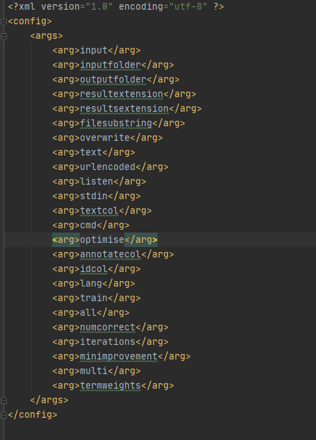

# 设计文档

| 修改者 | 时间      | 修改内容                                    | 版本 |
| ------ | --------- | ------------------------------------------- | ---- |
| 郑启睿 | 2023.4.1  | 创建文档，完成命令类command的设计文档部分   | v1.0 |
| 郑启睿 | 2023.4.5  | 对命令类command的设计文档进行补充           | v1.1 |
| 陈子凡 | 2023.4.10 | 对解析参数的重构进行说明                    | v2.0 |
| 郑启睿 | 2023.4.12 | 完成InputCommand的Strategy部分              | v3.0 |
| 游莫凡 | 2023.4.15 | 完成Paragraph、Sentence、term类重构进行说明 | v4.0 |
| 郁博文 | 2023.4.21 | 完成DIctList, DictMap的重构说明             | v5.0 |

## 配置文件处理参数解析

### 原本代码的问题

在原本的代码中，对于参数的解析采取了大量的if语句进行处理，大量的if语句不仅增加了解析命令的耦合度，同时也为以后扩展新的参数，实现新的功能带来了巨大的困难。在这种属性和实际设置逻辑极度分散的情况下，可以想象，如果在后续的迭代过程中有新的需求，需要设置新的参数，对源代码的修改将变得极度棘手。

（丑陋的if代码）


为了参数的可扩展，和设置对应参数的灵活调用，我将参数和其对应的解析函数名写入xml配置文件，同时藉由java的反射机制来调用对应的解析函数(一个参数对应一个解析函数)；




无论参数如何变化，都不会影响到方法调用逻辑；当我要添加新的参数时，我只需要更改配置文件，同时按照配置文件中对应的解析函数名编写对应的解析函数。

```java
String methodName = methodsList.get(argsList.indexOf(args[i]));
                try {
                    method = thisClass.getMethod(methodName, Integer.class, String[].class);
                } catch (NoSuchMethodException e) {
                    e.printStackTrace();
                }

```


同时我也注意到，对于不同的数据接收来源，对其可知的参数应该是变化的。例如对于输入文件夹和文件，机器学习相关的参数对其他的来源都应该是不可见的，但是源代码的写法，每一种数据来源对应的处理逻辑都可以发现所有的参数。这是完全违反了合理的职责分配。因此我设计了GlobalParameterHolder中介类来管理参数，在解析完成后，可以根据具体的数据来源生成对应的CommandOptions装配给Command类调用。


在经过这番重构后，解析参数这部分的代码在可维护性和可扩展性方面显著提升，同时尽可能地实现了相关逻辑内聚，更便于修改。


## 命令模式

在原本的代码中，SentiStrength通过解析输入的命令，在大量的if else之后进行逻辑处理，将命令接收者、命令处解析者、命令处理者、命令执行者等多个角色耦合在一起，不符合单一职责原则，并且依赖于实现而不依赖于抽象，不符合依赖倒置原则，也没有封装变化点


因此，我们需要用命令模式将其解耦。具体的设计类图如下：


我们定义了一个抽象类Command，它持有一个CommandOptions对象cmdOpt，存有Command中必要的参数，以及一个抽象方法action；然后我们将根据输入的类型不同将Command分为5类，分别是CmdCommand（使用cmd输入），InputCommand（输入文件或者文件夹），ListenCommand（监听端口），StdInCommand（用标准输入流输入），TextCommand（输入单行文本），每个方法中实现自己的具体的action()的方法


而SentiStrength持有一个Command对象，并利用java反射机制，使用XML文件进行对象类别的获取，这样就在SentiStrength中的该部分符合了开放封闭原则，就算加入新的类也不用修改源代码

```
//解析全局参数
GlobalParameterHolder globalParameterHolder = new GlobalParameterHolder(this.c);
GlobalParameterParse globalParameterParse = new GlobalParameterParse(globalParameterHolder, this.argsXMLUtil);
globalParameterParse.parse(args);

//获取解析的参数， 生成对应的命令
command = globalParameterParse.getCommand();
```


## 策略模式

在原代码中，InputCommand有多种不同的情况，用if else分隔，这样做十分的丑陋，不符合单一职责原则、封装变化原则


因此，使用策略模式对其进行修改，策略制定的依据为从sentiStrength官网上找到的SentiStrengthJavaManual.docx中的描述


UML类图如下


每个InputCommand持有一个InputStrategy，在判断完strategy的类别之后，只需执行this.getInputStrategy().calculate(inputCommandOptions)即可，每个stratgy执行自己的逻辑


## Paragraph、Sentence、term类重构

### paragraph类的问题

在paragraph的最主要的函数calculateParagraphSentimentScores()不仅代码量巨大，其中的逻辑非常复杂，各种参数耦合在一起，非常难读懂，可维护性，可扩展性低，故而进行重构

（208行超长代码）


#### 重构方式

##### 最小接口

将paragraph的类中的公共方法设计成一个个最小接口，使得后续开发其他类只需要依赖他需要的接口，提高系统的灵活性和可维护性


##### 模板模式

设计paragraph抽象类，实现所有的公共方法，并将原来的calculateParagraphSentimentScores()方法拆分成多个函数，每个函数分别计算不同的情绪值。

根据计算方式的不同划分不同的子类，从而划分出共三种子类，分别是计算Max情绪值子类，计算average情绪值子类，计算Total情绪值子类，子类分别实现父类中的抽象方法。

​																							**抽象类**


​														**calculateParagraphSentimentScores()方法拆分**	


​																									

​																											**子类**


##### 工厂模式

设计paragraph工厂，根据options中的选项igEmotionParagraphCombineMethod选择需要创建的paragraph子类


这样如果后续对于情绪计算方式有需求变更，代码更容易扩展和修改


### Sentence类的问题

paragraph需要调用sentence类计算paragraph的情绪分数，sentence需要调用term类计算sentence的情绪分数，作为中间类，sentence的计算方式更加复杂，并且这也导致它的职责过多，我们需要拆分职责。

#### 重构方式

##### 职责拆分

将sentence类中的计算方法拆分出去，创建新的计算类承担计算职责，如此拆分出两个计算类，分别调用term计算情绪分数和根据term的情绪分数计算sentence的情绪分数。

##### 组合模式

即便这样，sentence的复杂的计算方式问题依然没有解决，所以我们使用组合模式，将每一个计算逻辑单独抽象成一个计算策略类，创建复合计算主类持有所有计算策略类的引用并调用计算策略类的计算方法进行计算。

​																									**所有的计算策略类**


​																							**其中一个复合计算主类的实现**													


​																					**其中一个计算策略子类的实现**


这样，Sentence类的计算逻辑清晰，且职责划分明确，类不再臃肿，方便后续扩展和修改。


### Term类的问题

根据参数和方法可以发现Term有三种状态，分别是Word，Punctuation，Emoticon，这三种状态不会互相转换，所以可以据此设计Term抽象类和三种子类。

#### 重构方式

##### 最小接口

和paragraph类的重构方式一样，我们设计类Term类的最小接口

	

##### 组合模式

- 寻找公有方法

Term类中有一些方法和字段是某种状态专属的，有些方法和字段是所有状态公用的，我们需要将所有的公有方法和字段找出。

- 创建term抽象类

用寻找到的所有公有方法和字段构建term抽象类，Word、Punctuation、Emoticon三种子类继承该类的字段和方法。

- 创建子类

根据各个状态专属的方法和字段创建子类，子类继承和实现抽象父类的方法和字段的同时拥有子类特有的字段和方法。


##### 建造者模式

由于term类是Sentistrengh最底层的代码，如果后续有需求变更，term类必然会做修改，所以term类必然会越来越复杂，**为了预防工厂模式无法应对越来越复杂的term类的问题**，我们使用建造者模式创建term类。

- director类

可以指定term类创建的顺序


- builder类

具体的制造类，负责辨别传输进来的内容辨别需要创建的term子类，并为子类设置相关属性。


这样，我们就可以更好的应对需求变更对term类的扩展和修改。

## 词典类重构

在阅读项目代码时，我们发现，每个后缀带有List的java文件，也就是涉及到Sentistrength的字典功能的那些文件有很多相似性，并且其成员方法大多数只有方法签名的区别。据此，我们将这些list大致分为了两个抽象类，即DictList和DictMap。同时，剩下一些功能较为特别的不便于简单划分为这两大类的，我们仅仅优化了代码细节。

### DictList重构

对于这一类list而言，因为它们仅仅保存了单词本身，没有保存其他信息，故我们取名为DictList，满足这个特征的list有CorrectSpelling, Irony, NegatingWord, QuestionWords. 因此，我们实现了一个父类DictList，让这四个类继承这个父类。

DictList中包含两个方法，分别是initialise方法和contain方法，initialise方法用于将给定路径的List文件加载并进行初始化，主要用来维护一个包含单词的列表。而contain方法则用于查找list中是否包含特定单词。


### DictMap重构

对于这一类list而言，因为它们不仅保存了单词本身，还保存了单词对应的strength得分，故我们取名为DictMap，满足这个特征的list有BoosterWords, Emoticons. 因此，我们实现了一个父类DictMap，让这两个类继承这个父类。

DictMap中包含两个方法，分别是initialise方法和getStrength方法，initialise方法用于将给定路径的List文件加载并进行初始化，主要用来维护一个包含单词的map。而getStrength方法则用于查找map中特定单词的情感得分。


