# 自动化部署及基本开发过程说明文档

| 修改者 | 时间      | 修改内容           | 版本 |
| ------ | --------- | ------------------ | ---- |
| 陈子凡 | 2023.4.21 | 完成所有内容的编写 | v1.0 |

## gitlab-runner及服务器相关配置说明

本组购置了一台阿里云2g2核服务器进行服务的发布和环境的搭建，系统是centos8

采用gitlab-runner进行CICD，下面是runner的搭建过程

~~~shell
#安装gitlab-runner
yum install gitlab-runner -y

#进行runner的注册
gitlab-runner register

#接着输入对应的网址，注册令牌，runner的描述，tag，运行方式(shell, docker等)
~~~

本组build，test，deploy过程都采取shell的方式使用本机环境进行打包、测试、部署的流程。对于sentiStrength主项目的自动化发布，我们也采取了gitlab平台提供的服务来实现。由于该服务以docker镜像的方式提供，所以建立了一个采用docker运行的runner来执行发布任务。

sentiStrength项目的runner如下图所示

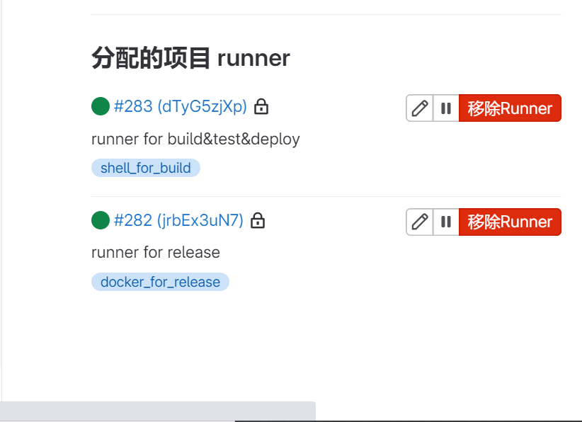

（对于前端和后端项目，也分别创建了各自的runner）

## 服务器环境说明

服务器需要用到maven，docker，nginx，tomcat

关于maven的配置，说明如下

- 配置了NJU和阿里云的镜像仓库，对依赖的下载更加顺畅

  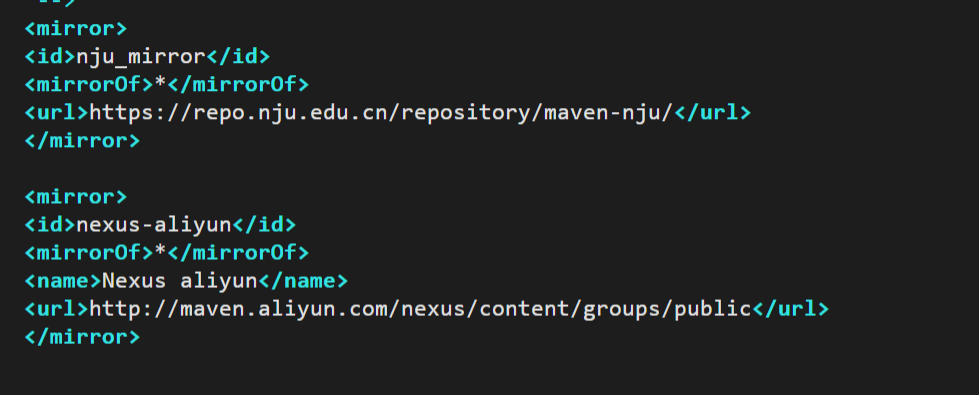

- 设置发布jar包到reop.nju.edu.cn的maven release和snapshots处

  jar包的管理和发布在repo.nju.edu.cn平台
  
  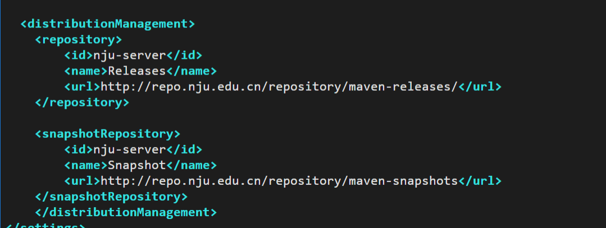

### 流水线运行情况说明

由于在迭代二中我们将git.nju.edu.cn作为本组的主仓库，将原仓库作为镜像仓库，而镜像仓库不会导入流水线情况，因此将流水线构建情况在此说明

#### sentiStrength主项目流水线项目

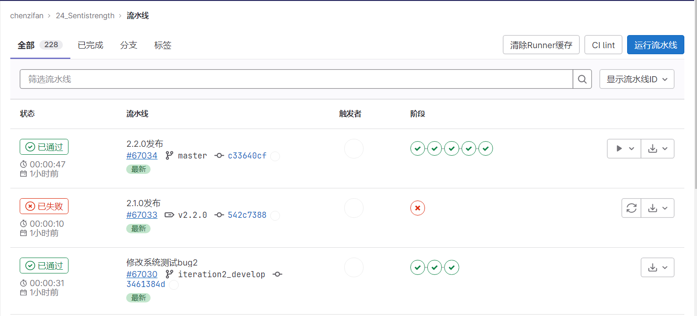

#### 后端流水线

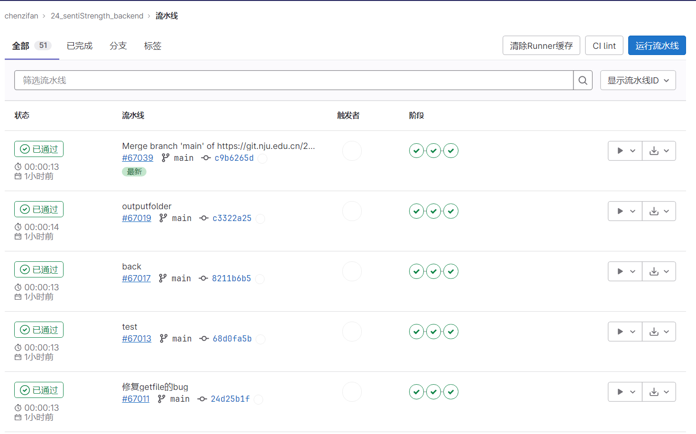

#### 前端流水线

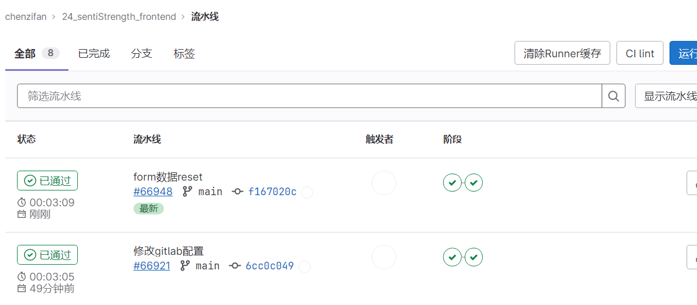

## 多分支开发历程

### 主项目的多分支

主项目采取了多分支开发，迭代2在iteration2_develop分支下进行，每一次git提交都会触发流水线，会部署一个当前版本的snapshot的jar包到远端的maven-sanpshots仓库内，后端的开发分支可以使用该snapshot的jar包进行开发

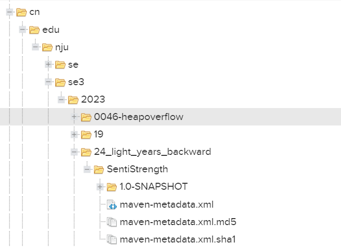

当开发分支的功能完全实现，并经过详细的测试后，将执行合并分支操作，合并分支并提交后，触发流水线，执行master分支的build，test和deploy操作(该操作是要经过手动触发的)，并且进行自动化发布。该操作会向远端nju仓库的maven-release文件夹内部署一个可对外提供稳定服务的jar包，同时发布也会提供一个jar包的下载地址。该jar包是在build阶段传送到服务器内并藉由服务器的tomcat提供对外下载的。

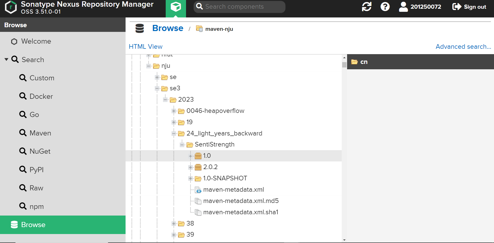

发布的jar包

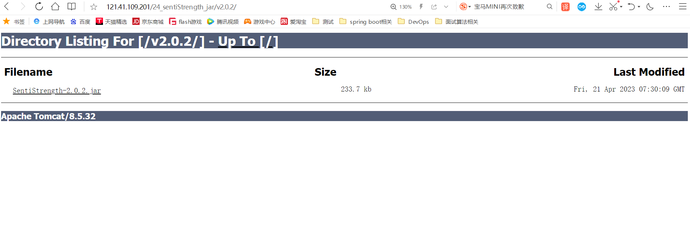

自动的release

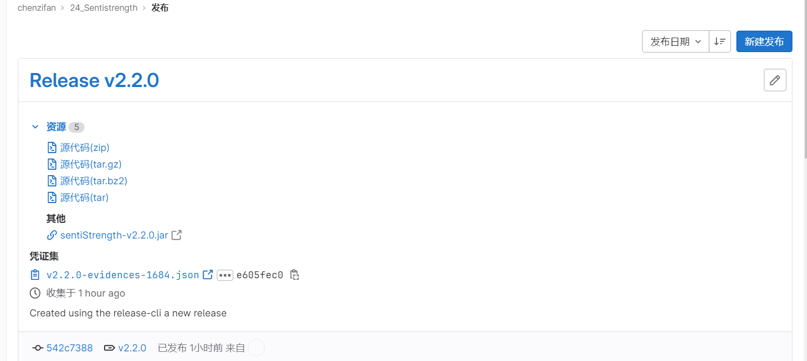

### 后端项目的多分支开发

专门建立了后端管理文件来管理开发

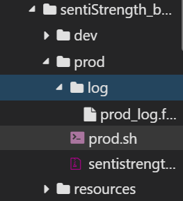

dev和prod文件夹分别会存放来自开发和生产环境的jar包和log日志，同时开发和生产环境会在不同的端口开启服务，该行为由sprinboot的配置文件来控制,通过设置server.port来配置服务端口。

由于自动化部署会反复在同一个端口开启，关闭服务，因此特地编写了bash脚本来优雅地控制这一行为

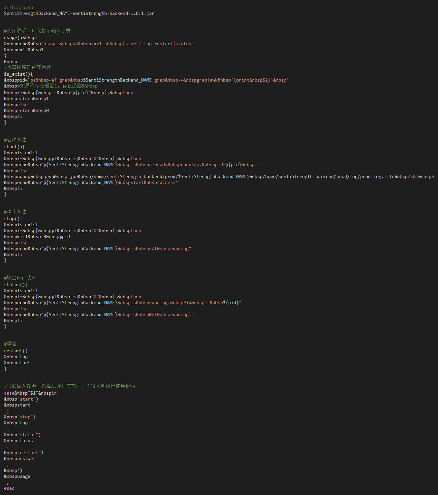

同时对于主分支服务手动触发部署的要求，也在gitlab-ci脚本中通过when:manual来控制