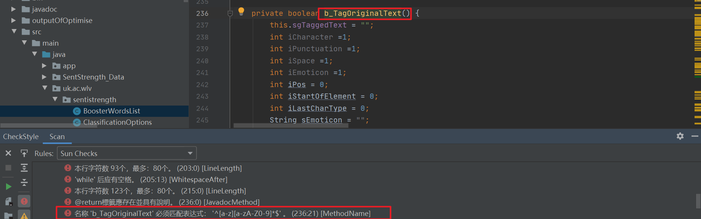
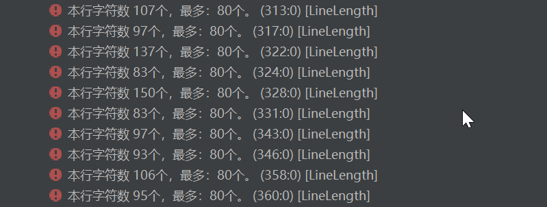

# checkstyle警告说明

| 日期      | 修改者 | 内容梗概                                 |
| --------- | ------ | ---------------------------------------- |
| 2023.3.31 | 郑启睿 | 创建文档，编写“运行”和“警告详情”中的内容 |
| 2023.3.31 | 邢俊杰 | 添加“警告详情”中的11，12，13             |

本文档为组内人员进行checkstyle警告修复的指导手册，仅供组内人员使用，**并非课程要求的checkstyle分析报告，请助教和老师不要认错了，课程要求的分析报告名为Report_checkstyle_X**

## 运行

下载checkstyle-9.3-all.jar，并在cmd中运行

```
java -jar checkstyle-9.3-all.jar -c /sun_checks.xml -f xml -o 项目代码分析/分析报告/checkstyle/checkstyle_errors_1.xml src/main/java/uk/ac/wlv
```

## 警告详情

对于警告需要有所鉴别，总结其出错原因和修改的准则
**原则**：少改动代码，处理时候不盲目大意，git提交多写点改动的情况。

### 需要解决的问题

1. 注解问题
   缺少注解，点击问题即可跳转到缺少注解的地方

 

注解不全，补齐就行，每一个@的值都要完整

例如：@return后面要有东西，不完整的return是不行的

2. 空格问题


符号前后，for/if/while/强制类型转换/||/&&/switch之后都要有空格，;前不需要空格

3. 魔术数字

   魔术数字的意思是莫名其妙、不知道怎么来的数字，需要一些注释进行解释，解释过后可以无视

4. 函数的括号

   函数{                                 而不是函数

   ​	；												{

   }													  ；

   ​														}

5. 命名问题要遵守命名规则（这条报错应该是因为在方法名中使用了_而不是驼峰）

6. 数组定义格式问题

    

   只需要将括号移至前面即可

    更正后：

   

7. 无用导入的包可以直接删除

   

8.  工具类没有必要添加public

    


### 可以忽略的问题

1. 
2. 

### 需要斟酌的问题

1. 

2. 

   检查局部变量或参数是否会遮蔽在相同类中定义的字段。

3. 

### 命名规则

常量驼峰命名，类名首字母大写，常量全大写（待补充与修改）

参考：[(8条消息) 最全详解CheckStyle的检查规则_ncss checkstyle_javaRoger的博客-CSDN博客](https://blog.csdn.net/rogerjava/article/details/119322285)

