# 第一次报告分析

| 修改者 | 时间        | 事件                      | 版本号  |
|-----|-----------|-------------------------|------|
| 郑启睿 | 2023.4.1  | 创建文档和大部分内容              | v1.0 |
| 邢俊杰 | 2023.4.15 | 对举例内容进行补充               | v1.1 |
| 郑启睿 | 2023.4.16 | 添加对于checkstyle报告的差异统计分析 | v2.0 |
| 邢俊杰 | 2023.4.17 | 添加暂时忽略的checkstyle问题以及解释 | v3.0 |

本次报告针对checkstyle_error_1和checkstyle_error_2之间的差异进行分析，checkstyle_error_1是对初始项目进行的checkstyle检测，checkstyle_error_2是对重构之前的项目进行checkstyle检测

## 1. 未进行全面checkstyle排查的部分

在阅读代码之后，我们小组一致认为sentistrength包是需要大面积重构的，因此并没有对这个类中的代码进行全面的checkstyle修复，而重点针对utilities包和wkaclass包进行彻底的checkstyle警告修复

## 2. 针对哪些警告进行修复

众所周知，checkstyle的警告十分的繁琐且有些规则条目的设置并不算合理，因此我们并没有对所有的警告进行修复，而是选取部分警告进行修复

### 进行修复的警告

#### (1) 有关空格的代码规范问题

例如，if与后边的括号之间要有空格、括号 ) 与大括号 { 之间要有空格，等号前后要有空格，等等等等有关空格的代码规范问题，是全部需要更正的

原代码：

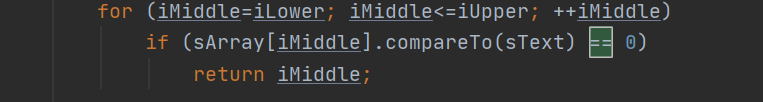

更改之后的代码：

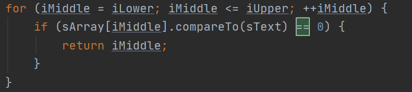

#### (2) 有关大括号的代码规范问题

例如，if无论里面的代码有多少行，都需要在前后添加大括号，此类问题需要全部更正

原代码：


更改之后的代码：


#### (3) 方法缺少JavaDoc

MissingJavadocMethodCheck，此类问题此类问题需要全部更正，即添加上JavaDoc

原代码：

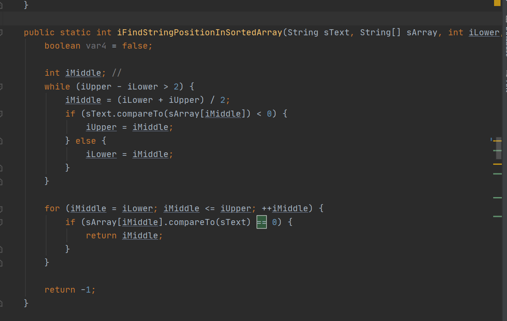

更正之后的代码：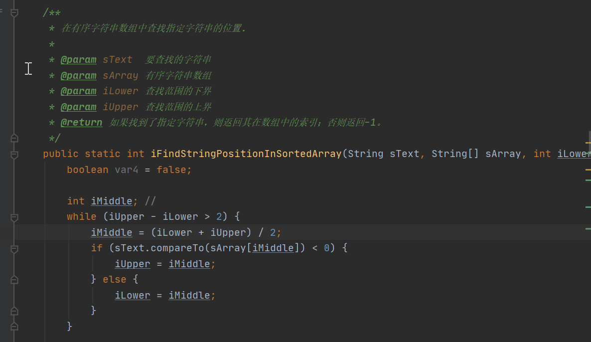

#### (4) 魔术数字

魔术数字magic number即为不明所以的、不知道原因的单个数字，我们尽可能的对其进行理解、更正和解释

原代码：

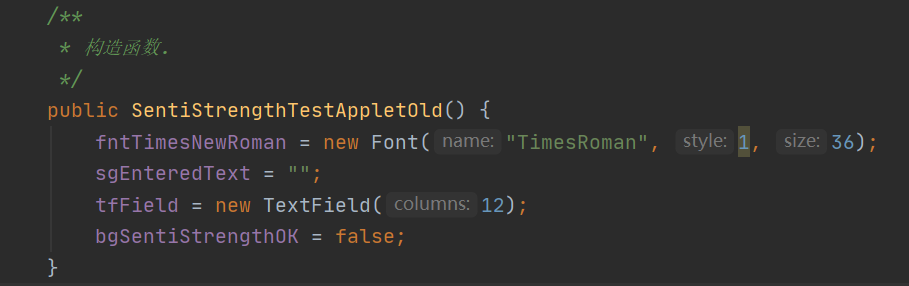

更改之后的代码：

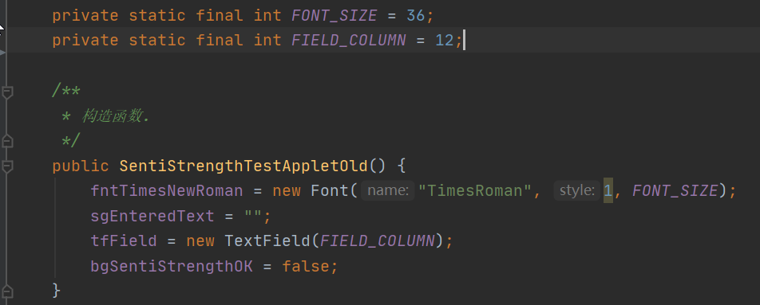

#### (5) 命名规范问题

命名规范使用驼峰命名法，不符合的一律更改

原代码

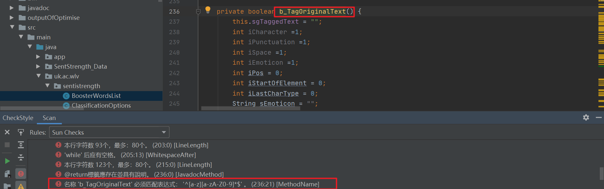

更正之后的代码：

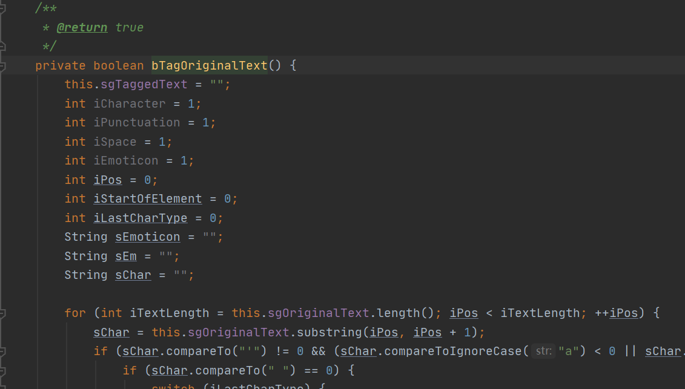

#### (6) 无用的导入包

无用导入的包可以直接删除

原代码


直接删除即可

#### (7) 数组括号位置问题

只需要将括号移至前面即可

原代码：

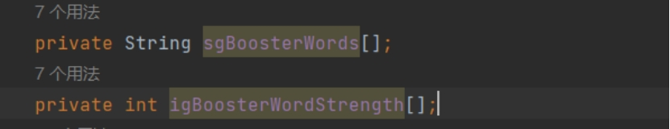

 更正后：

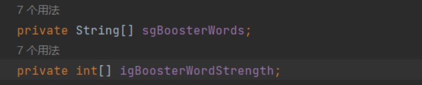

### 不进行修复的警告
#### (1) 单个行字符数过多的问题

因为原代码的某些变量名过长且经常出现多次引用，导致代码单个行的字符数过多，
因为此问题对代码系统逻辑功能毫无影响，而且修改需要改变原有变量、方法的名称，过于繁杂，且修改容易出错，因此选择忽略此问题。
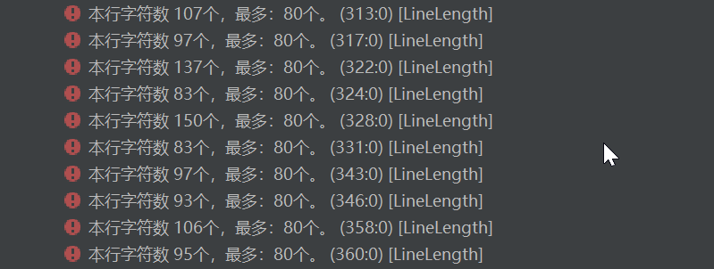

#### (2) 存在多余的空行

checkstyle将一些注释的语句视为了多余的空行，不需要进行修复。


#### (3) 变量/类/方法应定义为final

需要修改定义方式，因为不会对系统逻辑功能造成影响，不需要进行更改。
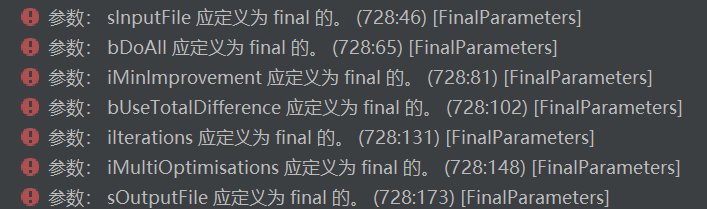

#### (4) 局部变量或参数会遮蔽在相同类中定义的字段

为了防止做冗余工作，初步的checkstyle中先搁置此问题，等到重构完成后再进行处理


#### (5) 变量访问权限设置问题

为了防止做冗余工作，初步的checkstyle中先搁置此问题，等到重构完成后再进行处理


## 3. 对比报告之间的差异

由于对代码进行checkstyle警告修复，对代码进行规范时，会造成行数变化、一行中的字符数变化等变化，虽然改变了error属性值，但是事实上还是同一个警告，因此我们决定将message和source相同的视为相同的error

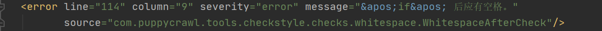

编写reportAnalysis进行分析

```
for (int i = 0; i < fileNodeList2.getLength(); i++) {
    Node file = fileNodeList2.item(i);
    NodeList errorList = file.getChildNodes();
    NodeList prevErrorList = fileNodeList1.item(i).getChildNodes();
    for (int j = 0; 2 * j + 1 < errorList.getLength(); j++) {
        // 获得message和source
        String message = errorList.item(2 * j + 1).getAttributes().getNamedItem("message").getNodeValue();
        String source = errorList.item(2 * j + 1).getAttributes().getNamedItem("source").getNodeValue();
        boolean same = false;
        for (int k = 0; 2 * k + 1 < prevErrorList.getLength(); k++) {
            if (message.equals(prevErrorList.item(2 * k + 1).getAttributes().getNamedItem("message").getNodeValue()) && source.equals(prevErrorList.item(2 * k + 1).getAttributes().getNamedItem("source").getNodeValue())) {
                same = true;
                break;
            }
        }
        if (same) {
            openWarning++;
        } else {
            newWarning++;
        }
    }
}
```

输出open的警告数、closed的警告数，new的警告数

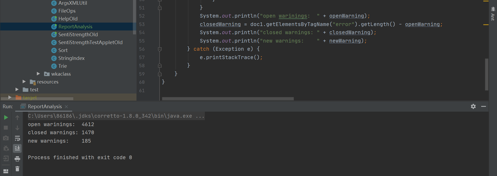

## 4. 新增警告分析

由上图可见，新增了185个警告。然而，其中绝大部分新生成的警告，都是在修改代码规范的同时造成字符数或是行数变化（例如，原本一行100，为了规范代码将原本位于下一行的 { 提到上一行，于是该行字符数变为101，被判断成”new“的警告）。将所有new的警告的message打印出来即可发现这个问题

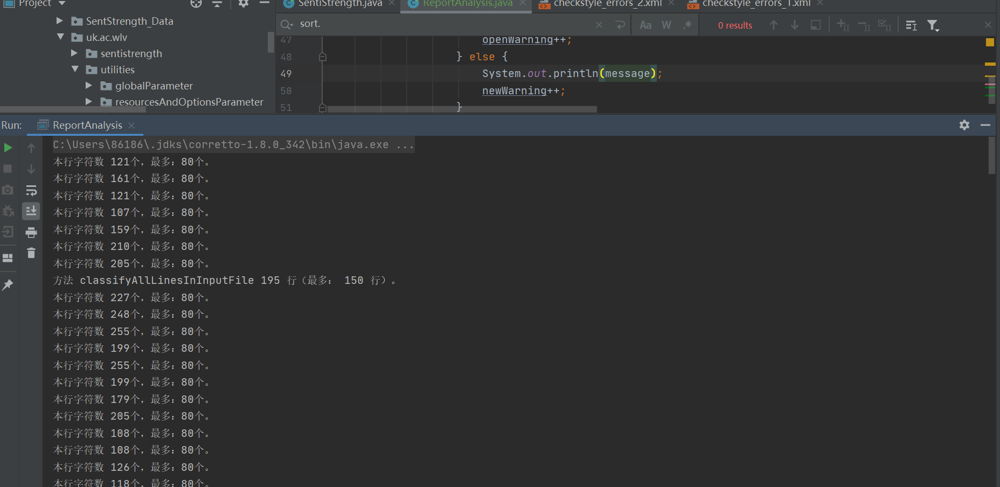

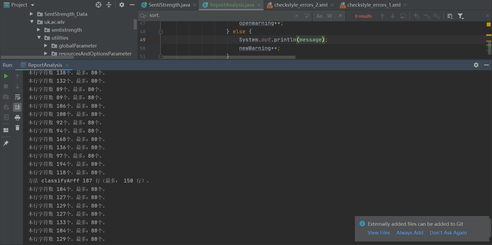