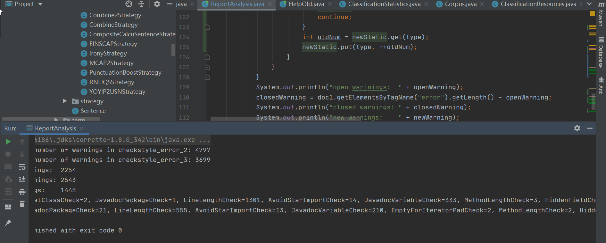
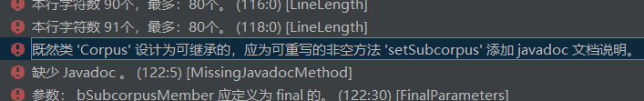
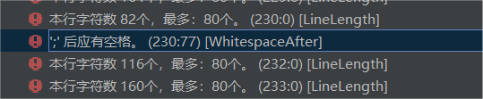
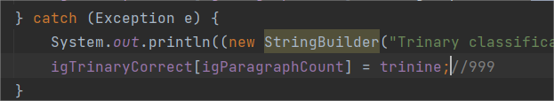
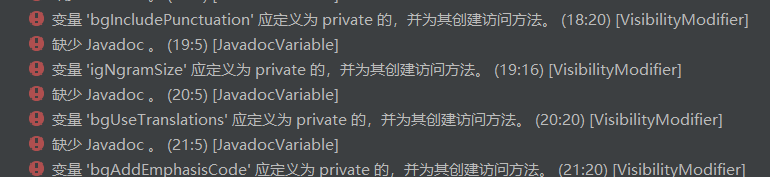
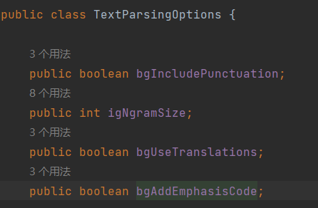
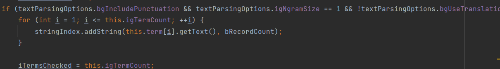
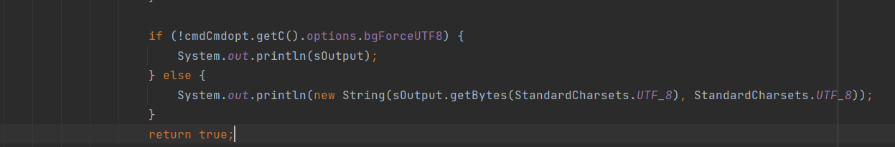
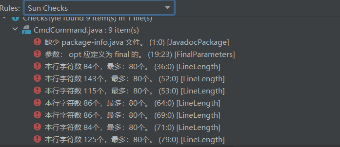

# 第二次报告分析

| 修改者 | 时间      | 事件                 | 版本号 |
| ------ | --------- | -------------------- | ------ |
| 郑启睿 | 2023.4.20 | 创建文档和大部分内容 | v1.0   |
| 邢俊杰 | 2023.4.20 | 添加了checkstyle漏报 | v1.1   |
| 郑启睿 | 2023.4.21 | 添加了分析统计       | v2.0   |

本次报告针对checkstyle_error_2和checkstyle_error_3之间的差异进行分析，checkstyle_error_2是对重构之前的项目进行的checkstyle检测，checkstyle_error_3是对重构之后的项目进行checkstyle检测

## 1. 警告差异的统计分析

输出了两次报告的warning总数，open、closed、new的warning的数量以及open和new的warning的具体类别统计

```
open: {FinalClassCheck=2, JavadocPackageCheck=1, LineLengthCheck=1301, AvoidStarImportCheck=14, JavadocVariableCheck=333, MethodLengthCheck=3, HiddenFieldCheck=3, ArrayTypeStyleCheck=8, HideUtilityClassConstructorCheck=10, VisibilityModifierCheck=128, ParameterNumberCheck=5, FinalParametersCheck=432, FileTabCharacterCheck=1, RegexpSinglelineCheck=12}

new:  {JavadocPackageCheck=21, LineLengthCheck=555, AvoidStarImportCheck=13, JavadocVariableCheck=210, EmptyForIteratorPadCheck=2, MethodLengthCheck=2, HiddenFieldCheck=152, ArrayTypeStyleCheck=1, HideUtilityClassConstructorCheck=1, VisibilityModifierCheck=90, ParameterNumberCheck=3, RedundantImportCheck=1, FinalParametersCheck=391, ConstantNameCheck=2}
```

可以看出，new和open的警告大部分是LineLengthCheck（每行字符不得超过80）和avadocVariableCheck（每个变量都需要javadoc），是我们接受的警告类型。而类似于MissingJavadocMethodCheck（每个方法都需要javadoc）这种我们不接受的警告则被完全消除。

## 2. 处理新增的警告
#### 1.应为可重写的方法添加javadoc：要修改只需添加javadoc说明即可

#### 2.在添加注释后应该在引号和双斜杠之间添加空格：只需添加空格即可



#### 3.变量应定义为private并添加访问方法：
此类错误要修改只需要将public修饰符改为private，但是也有不能进行修改的情况，例如：



可见TextParsingOptions类中的成员变量在其他包中存在被引用的情况，在这种情况下不能把public改成private，
否则会报错。

## 3. checkstyle漏报
重构过程中checkstyle漏报功能缺陷：

如图为CmdCommand中的action方法，在重构中添加return true后会导致while(true)
循环终止，出现功能缺陷，无法达到功能要求，此问题经过测试发现，checkstyle未能发现。
