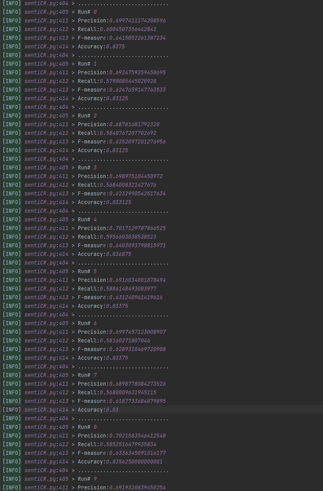

# 优化说明文档

**文档修改记录**

|   时间    | 操作者 |        修改内容        | 版本号 |
| :-------: | :----: | :--------------------: | :----: |
| 2023.5.30 | 郑启睿 |        创建文档        |  v1.0  |
| 2023.5.31 | 陈子凡 | 编写SnetiCR部分的文档  |  v2.0  |
| 2023.5.31 | 郑启睿 | 完善SnetiCR部分的文档  |  v2.1  |
| 2023.6.1  | 陈子凡 | 编写Sneti4SD部分的文档 |  v3.0  |
| 2023.6.1  | 郁博文 |   编写BERT部分的文档   |  v4.0  |


## SentiCR复现与提升实验报告

### 复现

SentiCR的源代码运行于python2环境，对于xlsx和列表的处理已经不适用于python3环境；在适配python3环境后，换用了openpyxl进行xlsx文件的处理

以下是在oracle.xlsx(即原作者提供的数据集)上的运行结果



原作者会在数据集上进行100次10折交叉验证，此处截取了8次10折交叉验证的结果，可以看到在GBT模型上的正确率确实可以达到83%，符合原文所说的GBT83.2%的正确率


### sentiCR运行助教提供数据集

sentiCR的作者将中性和积极的情绪归类为非消极，原本三分类的情感分析问题变成了二分类问题；因此得以使用1:1的欠采样平衡二类的数据数量；但是助教提供的是一个三分类的数据集，需要对sentiCR进行修改；首先在数据采样方面，我们不需要再进行欠采样，因为根据数据集提供者所言(senti4SD作者)，该数据集是建立在金标准之上的。同时我们也不需要进行10折交叉验证，我们存在训练集和测试集。在结果的统计方面，我们需要为三分类进行混淆矩阵的计算，然后分别计算每个类的recall，precision和f1score，最后计算总体的正确率。

由于助教提供的数据集是csv格式，便添加了data_load模块将csv数据集转换为xlsx格式，同时将positive,negative和neutral转换为1，-1, 0的数字表示。

以下是在GBT模型上的一次实验结果


可以看到就一次实验而言，sentiCR中GBT模型在新的数据集上的结果仍然较为不错。


我们同时还验证了不同的模型在该数据集上的运行情况，结果分别列于其下

| 模型 | 正确率 |
| ---- | ------ |
| ADB  | 80.32% |
| DT   | 76.09% |
| NB   | 80.39% |
| RF   | 83.25% |
| SGD  | 82.05% |
| SVC  | 81.98% |

*ps：请注意，以上结果皆是在一次实验获得的数据，并未多次实验获得平均结果；以上实验仅供粗略查看各个模型的性能*

### 尝试优化模型

#### 数据集处理部分

通过观察数据集我们发现，数据文本中还存在部分@ + 人名的现象，经讨论认为该部分对文本的极性并未有影响，因此设计函数，移除该部分。

#### 模型优化

经过观察，我们发现SGD、RF、BT、SVC这四个模型的性能较好，同时观察到他们在三个类的性能各存在差异；同时，额外尝试xgboost效果也不错（平均准确率大概在83%左右）；因此我们设计了集成模型，采取投票方式，集成了以上四个模型


#### 改进结果


从结果上来看，发现经过我们的尝试，确实在sentiCR上获得了略微的提升


### 实验中的一些反思

#### 关于数据增广

- 在优化的过程中我们曾考虑使用数据增广，但是在几次实验下来，发现增广后的数据集并未使结果获得提升，甚至还存在略有下降的情况。这可能是我们数据增广方式不恰当或者破坏了论文中所说的"金标准"的原因

#### 关于模型在三分类的性能区别

```
[INFO] 24_senti_main.py:261 > the result of experiment 0
[INFO] 24_senti_main.py:302 > -------------------------
[INFO] 24_senti_main.py:303 > recall_of_negative: 0.7777777777777778
[INFO] 24_senti_main.py:304 > precision_of_negative: 0.8045977011494253
[INFO] 24_senti_main.py:305 > f1score_of_negative: 0.7909604519774011
[INFO] 24_senti_main.py:306 > -------------------------
[INFO] 24_senti_main.py:302 > -------------------------
[INFO] 24_senti_main.py:303 > recall_of_neutral: 0.8149606299212598
[INFO] 24_senti_main.py:304 > precision_of_neutral: 0.828
[INFO] 24_senti_main.py:305 > f1score_of_neutral: 0.8214285714285714
[INFO] 24_senti_main.py:306 > -------------------------
[INFO] 24_senti_main.py:302 > -------------------------
[INFO] 24_senti_main.py:303 > recall_of_positive: 0.9323144104803494
[INFO] 24_senti_main.py:304 > precision_of_positive: 0.893305439330544
[INFO] 24_senti_main.py:305 > f1score_of_positive: 0.9123931623931625
[INFO] 24_senti_main.py:306 > -------------------------
[INFO] 24_senti_main.py:310 > Accuracy:0.8453996983408748
[INFO] 24_senti_main.py:261 > the result of experiment 1
[INFO] 24_senti_main.py:302 > -------------------------
[INFO] 24_senti_main.py:303 > recall_of_negative: 0.7555555555555555
[INFO] 24_senti_main.py:304 > precision_of_negative: 0.8071216617210683
[INFO] 24_senti_main.py:305 > f1score_of_negative: 0.7804878048780489
[INFO] 24_senti_main.py:306 > -------------------------
[INFO] 24_senti_main.py:302 > -------------------------
[INFO] 24_senti_main.py:303 > recall_of_neutral: 0.8188976377952756
[INFO] 24_senti_main.py:304 > precision_of_neutral: 0.8188976377952756
[INFO] 24_senti_main.py:305 > f1score_of_neutral: 0.8188976377952756
[INFO] 24_senti_main.py:306 > -------------------------
[INFO] 24_senti_main.py:302 > -------------------------
[INFO] 24_senti_main.py:303 > recall_of_positive: 0.9410480349344978
[INFO] 24_senti_main.py:304 > precision_of_positive: 0.896049896049896
[INFO] 24_senti_main.py:305 > f1score_of_positive: 0.9179978700745474
[INFO] 24_senti_main.py:306 > -------------------------
[INFO] 24_senti_main.py:310 > Accuracy:0.8438914027149321
[INFO] 24_senti_main.py:261 > the result of experiment 2
[INFO] 24_senti_main.py:302 > -------------------------
[INFO] 24_senti_main.py:303 > recall_of_negative: 0.7444444444444445
[INFO] 24_senti_main.py:304 > precision_of_negative: 0.8195718654434251
[INFO] 24_senti_main.py:305 > f1score_of_negative: 0.7802037845705968
[INFO] 24_senti_main.py:306 > -------------------------
[INFO] 24_senti_main.py:302 > -------------------------
[INFO] 24_senti_main.py:303 > recall_of_neutral: 0.8188976377952756
[INFO] 24_senti_main.py:304 > precision_of_neutral: 0.8172888015717092
[INFO] 24_senti_main.py:305 > f1score_of_neutral: 0.8180924287118976
[INFO] 24_senti_main.py:306 > -------------------------
[INFO] 24_senti_main.py:302 > -------------------------
[INFO] 24_senti_main.py:303 > recall_of_positive: 0.9432314410480349
[INFO] 24_senti_main.py:304 > precision_of_positive: 0.8816326530612245
[INFO] 24_senti_main.py:305 > f1score_of_positive: 0.9113924050632912
[INFO] 24_senti_main.py:306 > -------------------------
[INFO] 24_senti_main.py:310 > Accuracy:0.8416289592760181
```


截取部分实验结果，同时借助混淆矩阵，我们可以很明显地发现模型在消极一类上的性能较差，三项指标基本处于垫底状态；而在积极一类上的表现最好，召回率显示极大部分的积极一类都被正确的区分出来。而消极和中性的互相区分则很差，很明显，两者存在很大可能的互相归类错误的情况（中性划为消极，消极划为中性).

联想到作者在处理有消极词的文本是会进行not翻转的操作，即将否定词附近的动词和副词加前缀NOT的操作，我们不禁怀疑此举的有效性，因此我们将process_text中handle_negation操作注释掉（在采用MIX模型后），运行实验。得到以下结果


我们发现总体正确率并未产生大幅波动，因此难以证明该操作对提高消极分类正确率的可用性。

### #训练参数

训练参数如下

```
VotingClassifier(
                estimators=[('GBT',GradientBoostingClassifier(n_estimators=200)),
('sgd', SGDClassifier(loss='log_loss')),
('rf', RandomForestClassifier(n_estimators=200, criterion="entropy")),
('svc', svm.SVC()),
('xgb', xgb.XGBClassifier())],voting='hard')
```


## Senti4SD复现报告

考虑到优化后的sentiCR在数据集上的正确率依旧不是特别理想，在查阅论文时，发现senti4SD使用了2000万条stackoverflow评论预训练了模型，在数据集上可以达到recall, precision和f1score上皆可以达到87%的水平，因此选取了senti4SD作为研究对象

### 复现对象：pySenti4SD

原仓库提供的train.sh无法直接在华为云 ubuntu20.04服务器上运行，经调试，需要添加inputFiles=()语句；同时由于数据集使用csv文件而csv文件的分隔符作者采用的是‘；’, 因此需要使用bash train.sh -i train_stackoverflow.csv -i test_stackoverflow.csv -d sc 来指定训练集和测试集和分隔符";"


### 复现结果

由于训练存在调参过程，因此下面选取结果最好的一次进行展现


完整的结果输出请见senti4sd_liblinear_perfomance文件夹

结果大抵符合senti4SD所列出的数据

### 训练参数

选取自带调参中最好的一次结果


## BERT实验报告

在此次实验中，为了达到更好的情感分析预测结果，我们使用了Roberta模型。同时，我们在Roberta模型上额外增加了一些层来提高分类任务的表现。

### BERT与Roberta

BERT是由Google研究团队于2018年提出的一种预训练语言模型。相比于以往的语言模型，BERT引入了双向（bidirectional）训练机制，能够同时利用上下文信息进行预测任务。BERT模型通常使用了一个双向Transformer编码器，该编码器能够学习输入文本中的上下文信息，生成高质量的文本表示。BERT在多项NLP任务中表现出色，如文本分类、命名实体识别、问答系统等。

RoBERTa是由Facebook研究团队在2019年改进BERT模型的基础上提出的。RoBERTa的目标是通过更好的训练策略和超参数调整来进一步提高模型性能。相较于BERT，RoBERTa使用更大的模型规模和更长的训练时间，并对训练数据进行了增强。RoBERTa在各种NLP任务中展现了比BERT更好的性能。

在决定使用语言预训练模型时，我们最初考虑使用BERT。同时，为了优化实验结果，我们没有使用BERTForSequentialClassification，而是自行包装了一个类，具体来说，我们在BERTModel的基础上，额外增加一个线性层，一个Relu激活函数，具体代码如下：

```python
class BertClassifier(nn.Module):
    def __init__(self, ):
        """
        freeze_bert (bool): 设置是否进行微调，0就是不，1就是调
        """
        super(BertClassifier, self).__init__()
        # 输入维度(hidden size of Bert)默认768，分类器隐藏维度，输出维度(label)
        D_in, H, D_out = 768, 100, 3

        # 实体化Bert模型
        self.bert = BertModel.from_pretrained('bert-base-uncased')

        # 实体化一个单层前馈分类器，说白了就是最后要输出的时候搞个全连接层
        self.classifier = nn.Sequential(
            nn.Linear(D_in, H),  # 全连接
            nn.ReLU(),  # 激活函数
            nn.Linear(H, D_out)  # 全连接
        )

    def forward(self, input_ids, attention_mask):
        # 开始搭建整个网络了
        # 输入
        outputs = self.bert(input_ids=input_ids,
                            attention_mask=attention_mask)
        # 为分类任务提取标记[CLS]的最后隐藏状态，因为要连接传到全连接层去
        last_hidden_state_cls = outputs[0][:, 0, :]
        # 全连接，计算，输出label
        logits = self.classifier(last_hidden_state_cls)

        return logits
```

但是，使用BERT模型的效果并不理想，最佳情况也只有88%左右。所以，为了是结果更加完善，我们使用了Roberta模型。具体来说，使用的是“cardiffnlp/twitter-roberta-base-sentiment”这个模型。同时在输出层增加了lstm,cnn等层来提升输出结果。具体代码如下：

```python
class BertClassifier(nn.Module):
    def __init__(self, freeze_bert=0):
        """
        freeze_bert (bool): 设置是否进行微调，0就是不，1就是调
        """
        super(BertClassifier, self).__init__()
        # 输入维度(hidden size of Bert)默认768，分类器隐藏维度，输出维度(label)
        D_in, H, D_out = 768, 100, 3

         # 实体化Bert模型
        # self.bert = AutoModel.from_pretrained("microsoft/deberta-base")
        self.bert = RobertaModel.from_pretrained("cardiffnlp/twitter-roberta-base-sentiment")

        # Add a MultiheadAttention layer
        self.attention = nn.MultiheadAttention(D_in, num_heads=4)


        # Add padding to the CNN layer
        self.cnn = nn.Conv1d(D_in, H, kernel_size=3, padding=1)

        # Add padding to the residual block
        self.res_block = ResidualBlock(H, H, kernel_size=3, padding=1)

        # Add a Bidirectional GRU layer
        self.gru = nn.GRU(H, H // 2, batch_first=True, bidirectional=True) # 添加一个双向GRU层

        self.lstm = nn.LSTM(H, H // 2, batch_first=True)

        # Add an Adaptive Max Pooling layer
        self.adaptive_max_pool = nn.AdaptiveMaxPool1d(1) # 添加一个自适应最大池化层
        
        

        # 实体化一个单层前馈分类器，说白了就是最后要输出的时候搞个全连接层
        self.classifier = nn.Sequential(
            nn.Linear(H//2, H // 4),  # 全连接
            nn.BatchNorm1d(H // 4),
            nn.ReLU(),  # 激活函数
            nn.Dropout(0.2),  # Dropout
            nn.Linear(H // 4, 50),  # 全连接
            nn.ReLU(),
            nn.Dropout(0.2),
            nn.Linear(50, D_out),
            nn.Softmax(dim=1)
        )

    def forward(self, input_ids, attention_mask):
        # 开始搭建整个网络了
        # 输入
        outputs = self.bert(input_ids=input_ids,
                            attention_mask=attention_mask)

        # Use the last hidden state output from BERT encoder
        last_hidden_state = outputs[0]


        # Apply attention to the BERT output
        attn_output, _ = self.attention(last_hidden_state.transpose(0, 1), last_hidden_state.transpose(0, 1),
                                        last_hidden_state.transpose(0, 1))
        attn_output = attn_output.transpose(0, 1)


        # Apply CNN layer to the hidden states
        cnn_output = self.cnn(attn_output.transpose(1, 2))
        
         # Apply residual block to the CNN output
        res_output = self.res_block(cnn_output)

        # Apply Bidirectional GRU layer to the CNN output
        gru_output, _ = self.gru(res_output.transpose(1, 2)) # 添加一个双向GRU层
        
        lstm_output, _ = self.lstm(gru_output)
        
        max_pool_output = self.adaptive_max_pool(lstm_output.transpose(1, 2)).squeeze(-1) # 添加一个自适应最大池化层
        
        logits = self.classifier(max_pool_output)
        
        
        return logits


```

首先，模型使用了预训练的Roberta模型作为特征提取器，将文本转换为768维的向量表示。然后，模型使用了一个多头注意力层，对文本向量进行自注意力计算，增强其语义信息。接着，模型使用了一个一维卷积层，对文本向量进行局部特征提取，增加其抽象能力。紧接着，模型使用了一个残差块，对卷积层的输出进行非线性变换和残差连接，增强其表达能力。之后，模型使用了一个双向GRU层，对文本向量进行序列建模，捕捉其上下文信息。然后，模型使用了一个LSTM层，对GRU层的输出进行进一步的序列建模，增强其长期依赖能力。接着，模型使用了一个自适应最大池化层，对LSTM层的输出进行降维和全局特征提取。最后，模型使用了一个前馈神经网络作为分类器，对池化层的输出进行线性变换、批归一化、激活函数、Dropout和Softmax操作，得到最终的分类结果。

经过实验，我们发现，这样做可以使分类准确率提升至90.42%

### 实验结果

最终，我们的Roberta分类模型的混淆矩阵输出如下：

需要注意的是，为了使Roberta模型能够理解分类标签。我们将积极，中性和消极分别转为数字0，1，2

|      | 0    | 1    | 2    |
| ---- | ---- | ---- | ---- |
| 0    | 319  | 39   | 2    |
| 1    | 37   | 444  | 27   |
| 2    | 1    | 21   | 436  |

|           | 0      | 1      | 2      |
| --------- | ------ | ------ | ------ |
| recall    | 0.8861 | 0.8740 | 0.9520 |
| precision | 0.8936 | 0.8810 | 0.9376 |
| f1-score  | 0.8898 | 0.8775 | 0.9447 |

总体的accuracy为0.9042

### 训练参数

batch_size:16

学习率：5e-6

精度：1e-8

优化器：AdamW

学习率预热：linear_schedule

预热步骤：0

其余部分均为默认参数


## 实验结果对比

sentiStrength


senti4SD


sentiCR


BERT


结果对比

|          | sentiStrength | sentiCR | senti4SD | bert   |
| -------- | ------------- | ------- | -------- | ------ |
| accuracy | 82.28%        | 84.85%  | 87.63%   | 90.43% |

