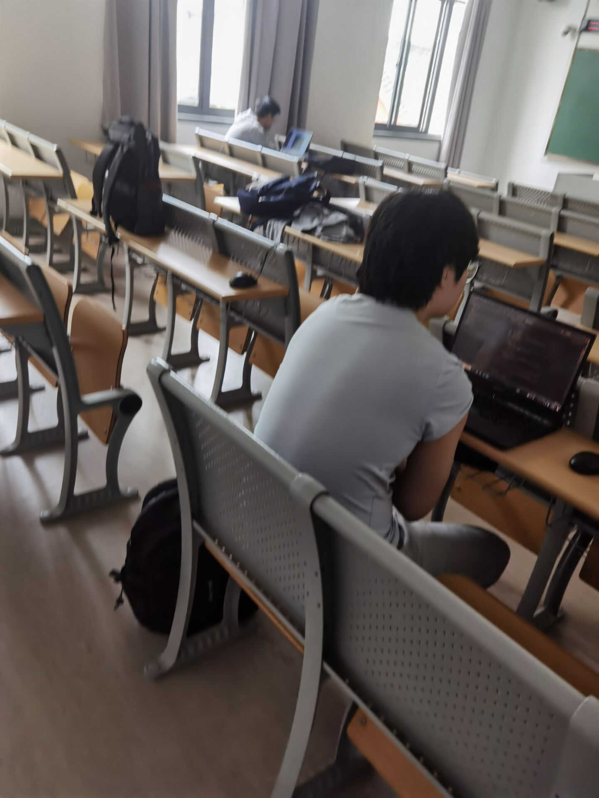

# 2023.05.23会议记录

## 1.会议具体过程

### 1.1 会议参与人员

陈子凡、邢佳勇、邢俊杰、郁博文，游莫凡、郑启睿

### 1.2 会议时间

2023-05-23 18：00

### 1.3 会议地点

教学楼405

### 1.4 会议项目

对sentiCR进行复现，进行senti4SD数据的实验

### 1.5会议目标

理解sentiCR代码，对senti4SD的数据进行预处理，进行基于senti4SD数据的初步实验，找出优化方案

### 1.6 会议内容

根据上一次会议的分工，在教室中一起完成

- 了解sentiCR代码的大致含义
- 完成对senti4SD数据的预处理，使其可以事件在sentiCR上运行
- 寻找可能的优化方案：
  - 数据增广：对senti4SD的数据进行增广可能对模型的优化有所帮助
  - 数据清洗：尝试使用置信学习clean learning对可能存在的噪声标签进行清洗
  - 模型尝试：尝试使用一些原本没有的模型
  - 集成模型：将多个表现优良的集成起来提高总体性能
  - 参数调优：对细节参数进行调试和实验

细化分工如下：数据增广部分由游莫凡和郁博文负责，置信学习方面由郑启睿负责，模型集成由郑启睿和邢俊杰负责，模型尝试由邢佳勇、陈子凡和郑启睿负责，参数调优由邢俊杰和邢佳勇负责。此外，陈子凡负责编写主函数串联整个功能

PS：在询问助教后发现不需要进行前端展示，因此更改上次一会议中制作前端的目标。

## 2.会议报告内容

| 会议日期 | 2023-05-23 6：00                                             |
| -------- | ------------------------------------------------------------ |
| 参会者   | 全体成员                                                     |
| 会议目标 | 进行sentiCR的尝试和探究                                      |
| 会议内容 | 了解sentiCR代码的大致含义；完成对senti4SD数据的预处理，使其可以事件在sentiCR上运行；寻找可能的优化方案：数据增广、数据清洗、模型尝试、集成模型、参数调优；进行分工和尝试 |

