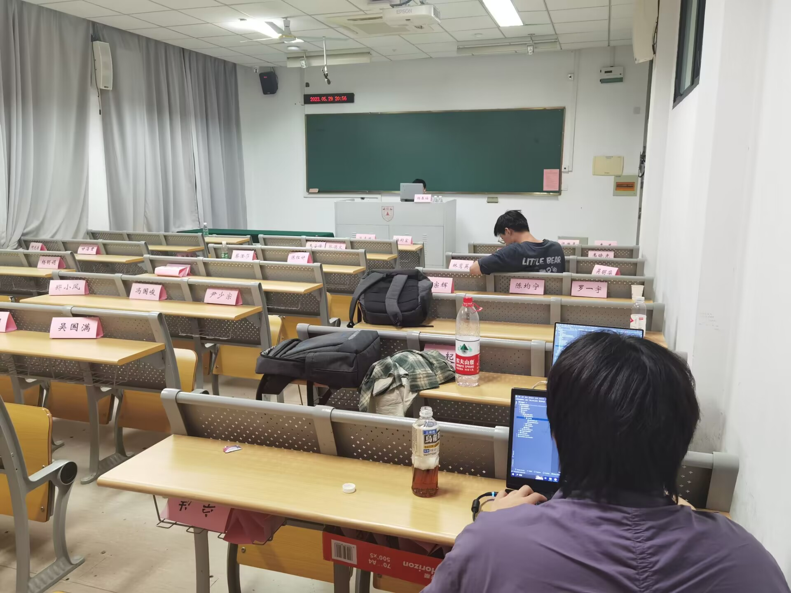

# 2023.05.25会议记录

## 1.会议具体过程

### 1.1 会议参与人员

陈子凡、邢佳勇、邢俊杰、郁博文，游莫凡、郑启睿

### 1.2 会议时间

2023-05-25 18：00

### 1.3 会议地点

教学楼405

### 1.4 会议项目

对这两天的优化实验进行汇总、效果评估

### 1.5会议目标

评估优化效果，设计新的更好的方案来追求更高的准确率

### 1.6 会议内容

根据上次会议的分工，进行结果的汇总：

- 使用SMOTE进行过采样，有0.5%左右的准确率提升，采用；使用随机替换同义词，随机切片swap进行数据增广，效果不好，放弃
- 使用置信学习进行数据集噪声清除，效果不好，放弃
- 尝试使用xgboost、svm.SVC等模型进行尝试，最后只有xgboost和svm.SVC的准确率符合标准，采用这两个模型
- 进行模型集成，选取五个最好的模型进行集成（xgboost、RandomForrest、GradientBoosting、SGD、SVC），有1%左右的准确率提升，采用
- 进行参数调优，有0.5%左右的准确率提升，采用

只是用机器学习，最高正确率提升到85%左右，难以突破

新的方向：考虑使用深度学习，暂定目标：BERT，LSTM，希望能达到90%的准确率

## 2.会议报告内容

| 会议日期 | 2023-05-25 6：00                                             |
| -------- | ------------------------------------------------------------ |
| 参会者   | 全体成员                                                     |
| 会议目标 | 优化探索的结果汇总，新方案的探索                             |
| 会议内容 | 进行优化结果的汇总，整体准确率提高2%左右，但也有大量手段效果不增反降，整体正确率难以突破85%；考虑尝试深度学习来提高准确率，进行初步尝试 |

