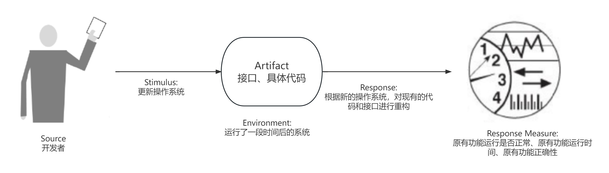
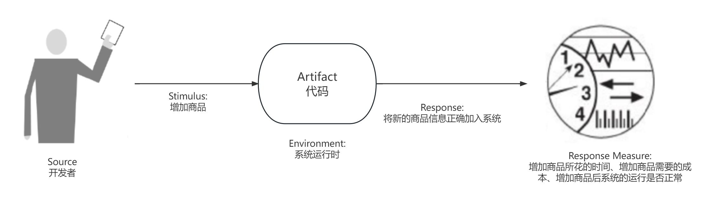
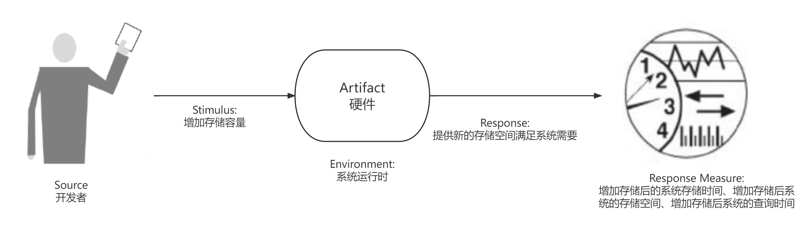

    
                     
                  对质量属性的分析和讨论          	
Sustainability & Flexibility, Modifiability & Scalability 
	        <table style="border:none;text-align:center;width:72%;font-family:仿宋;font-size:14px; margin: 0 auto;">    <tbody style="font-family:方正公文仿宋;font-size:12pt;">    	<tr style="font-weight:normal;">     		<td style="width:20%;text-align:right;">学　　院</td>    		<td style="width:2%">：</td>     		<td style="width:40%;font-weight:normal;border-bottom: 1px solid;text-align:center;font-family:华文仿宋"> 软件学院</td>     </tr>    	<tr style="font-weight:normal;">     		<td style="width:20%;text-align:right;">创建时间</td>    		<td style="width:2%">：</td>     		<td style="width:40%;font-weight:normal;border-bottom: 1px solid;text-align:center;font-family:华文仿宋"> 2023年5月2日</td>     </tr>    	<tr style="font-weight:normal;">     		<td style="width:20%;text-align:right;">授课教师</td>    		<td style="width:2%">：</td>     		<td style="width:40%;font-weight:normal;border-bottom: 1px solid;text-align:center;font-family:华文仿宋">张贺、潘敏学 </td>     </tr>    	<tr style="font-weight:normal;">     		<td style="width:20%;text-align:right;">姓　　名</td>    		<td style="width:2%">：</td>     		<td style="width:40%;font-weight:normal;border-bottom: 1px solid;text-align:center;font-family:华文仿宋"> 郁博文</td>     </tr>    	<tr style="font-weight:normal;">     		<td style="width:20%;text-align:right;">学　　号</td>    		<td style="width:2%">：</td>     		<td style="width:40%;font-weight:normal;border-bottom: 1px solid;text-align:center;font-family:华文仿宋">201250070 </td>     </tr>    </tbody>                  </table>

## 1. Quality Attribute Scenarios

### 1.1 Sustainability & Flexibility

#### 1.1.1 General Scenario

> Table 1: General Scenario of Sustainability

| Portion of Scenario | Possible Values                                              |
| ------------------- | ------------------------------------------------------------ |
| Source              | 开发者，维护人员，系统管理员，领域专家                       |
| Stimulus            | 平台需要更新迭代，软件和硬件系统落后                         |
| Artifact            | 接口、代码架构、系统服务                                     |
| Environment         | 有一定运行时间后的系统                                       |
| Response            | 根据新的软硬件版本，设计出具体的新的接口和代码框架设计，将原本的设计进行更新或重构，同时保证原本的用户需求得到实现 |
| Response Measure    | 用户需求得到满足，新的系统不会产生问题，重构成本是否低于重新开发成本 |

> Table 2: General Scenario of Flexibility

| Portion of Scenario | Possible Values                                    |
| ------------------- | -------------------------------------------------- |
| Source              | 开发者、维护人员                                   |
| Stimulus            | 系统的运行环境需要修改，系统的需求需要更改         |
| Artifact            | 代码具体内容、代码具体架构、系统接口实现、系统服务 |
| Environment         | 系统的生命周期内                                   |
| Response            | 按照需求的变更对系统进行相应的修改以适配新的需求   |
| Response Measure    | 修改需求的成本、修改后的系统运行时间               |

#### 1.1.2 Concrete Scenario

> Figure 1: Concrete Scenario of Sustainability

> Figure 1: Concrete Scenario of Flexibility

### 1.2 Modifiability & Scalability

#### 1.2.1 General Scenario

> Table 1: General Scenario of Modifiability

| Portion of Scenario | Possible Values                                              |
| ------------------- | ------------------------------------------------------------ |
| Source              | 开发者，维护人员，系统管理员，领域专家                       |
| Stimulus            | 需要增加/删除/修改功能或改变质量属性                         |
| Artifact            | 服务、代码、数据、接口、硬件                                 |
| Environment         | 运行时，编译时，构建是，初始化，设计                         |
| Response            | 实现修改，测试修改，部署修改                                 |
| Response Measure    | 物质成本，受影响的工件数量、大小和复杂度，预期时间，修改的影响范围 |

> Table 2: General Scenario of Scalability

| Portion of Scenario | Possible Values                                              |
| ------------------- | ------------------------------------------------------------ |
| Source              | 开发者、维护人员、系统管理员                                 |
| Stimulus            | 增加系统资源的负载或需求，如进程、I/O、或是储存的负载或需求。 |
| Artifact            | 服务、代码、数据、接口、硬件                                 |
| Environment         | 系统的生命周期内                                             |
| Response            | 系统提供一个新的资源去满足新的需求或是负载                   |
| Response Measure    | 负载增加时提供额外资源的时间、增加的成本与新资源能够提供的新价值的比率 |

#### 1.2.2 Concrete Scenario

> Figure 1: Concrete Scenario of Modifiability

> Figure 1: Concrete Scenario of Scalability

## 2. Tactics

> Table 1: Strategy & Tactics of  Sustainability & Flexibility

|               | Sustainability                     | Flexibility                      |
| ------------- | ---------------------------------- | -------------------------------- |
| Strategy 1    | 使用先进的软件开发技术和条件       | 考虑系统运行的各种场景           |
| Tactic 1.1    | 敏捷开发                           | 进行不同的测试                   |
| Benefit 1.1   | 能及时应对开发中的需求变更         | 可以增加系统在不同环境的适应能力 |
| Penalties 1.1 | 不适用于大型团队                   | 消耗大量资源编写测试             |
| Tactic 1.2    | 面向对象开发                       | 代码中考虑各种可能发生的问题     |
| Benefit 1.2   | 容易进行代码的编写                 | 系统不容易崩溃                   |
| Penalties 1.2 | 程序的处理效率较慢                 | 大量判断导致运行缓慢             |
| Strategy 2    | 对系统进行维护                     | 用简单构造复杂                   |
| Tactic 2.1    | 定期维护系统并且替换老旧的组件     | 将代码分模块编写                 |
| Benefit 2.1   | 提高系统的寿命                     | 代码可以重复进行调用             |
| Penalties 2.1 | 增加运维成本                       | 单一模块的问题可能影响多处       |
| Tactic 2.2    | 定期对系统进行检查或测试           | 提高模块的通用性                 |
| Benefit 2.2   | 保障运行阶段的质量                 | 程序容易修改和扩展               |
| Penalties 2.2 | 检查期间会导致系统需要暂时停止运行 | 泛化性的代码运行速度低下         |

> Table 2: Strategy & Tactics of  Modifiability & Scalability

|               | Modifiability              | Scalability                      |
| ------------- | -------------------------- | -------------------------------- |
| Strategy 1    | 控制包的大小               | 提高内聚                         |
| Tactic 1.1    | 拆分模块                   | 模块遵循单一职责原则             |
| Benefit 1.1   | 降低修改成本               | 每个某块逻辑简单                 |
| Penalties 1.1 | 功能分散调用复杂           | 过度的内聚增加系统中元素的依赖   |
| Tactic 1.2    | 增加语义一致性             | 将任务分解成多个功能独立的子函数 |
| Benefit 1.2   | 分离职责                   | 方便排查错误                     |
| Penalties 1.2 | 模块复杂繁多               | 过度的内聚增加系统中元素的依赖   |
| Strategy 2    | 降低耦合                   | 降低耦合                         |
| Tactic 2.1    | 使用接口、封装等松耦合手段 | 使用接口、封装等松耦合手段       |
| Benefit 2.1   | 调用者不需要知道具体实现   | 调用者不需要知道具体实现         |
| Penalties 2.1 | 不利于深入调试             | 不利于深入调试                   |
| Tactic 2.2    | 严格限制依赖               | 严格限制依赖                     |
| Benefit 2.2   | 降低耦合，容易修改和扩展   | 降低耦合，容易修改和扩展         |
| Penalties 2.2 | 不利于深入调试             | 不利于深入调试                   |

## 3. Quality Attribute Debate

### Sustainability

可持续性是指系统在长期内能够保持稳定的性能并且能够适应变化。这可以通过使用可持续的开发方法和技术来实现，例如使用可重用的代码和采用可扩展的架构。这些方法和技术都可以提高系统的可维护性，因为它们可以使系统更易于修改和维护。

与此相反，如果系统在长期内无法保持稳定的性能或者不能适应变化，那么它可能会变得难以维护。例如，如果系统的代码结构过于复杂或不可重用，那么在进行修改或维护时将会变得困难。因此，可持续性可以视为系统的可维护性的一种保证。

另外，可持续性还与系统的环境和社会责任相关。如果系统能够有效地利用资源并减少对环境的影响，那么它就可以被认为是可持续的。这也可以提高系统的可维护性，因为可持续的系统通常需要更少的维护和修复工作。

### Flexibility

灵活性和可维护性是相互关联的，它们对软件系统的长期稳定性和适应性都有重要影响。灵活性可以通过使用可重用的代码和采用可扩展的架构等方法来实现，从而使系统更容易修改和维护。这些方法和技术都可以提高系统的可维护性，因为它们使系统更容易适应变化，减少了在进行修改或扩展时的复杂性和工作量。

相反，如果系统设计过于僵化，那么在需要进行修改或扩展时，将会变得更加困难和耗时。这可能会导致更多的错误和漏洞，增加维护的成本和难度。因此，灵活性可以视为系统的可维护性的一种保证。

此外，灵活性还可以增强系统的适应性，使其能够更好地满足用户需求。这也可以进一步提高系统的可维护性，因为适应性强的系统需要更少的维护和修复工作。

综上所述，灵活性和可维护性密切相关，通过实现灵活的设计和架构，可以提高系统的可维护性，从而保证系统的长期稳定性和适应性。

### Modifiability

可修改性是指系统的易于修改程度。如果系统设计得易于修改，那么在需要进行修改时，它将更容易进行调整。这种可修改性可以通过使用模块化的代码和采用松散耦合的架构来实现。这些方法和技术都可以提高系统的可维护性，因为它们可以使系统更容易修改和维护。

与此相反，如果系统设计得过于紧密耦合，那么在需要进行修改时，将会变得更加困难和耗时。例如，如果系统的代码结构过于复杂或缺乏良好的模块化，那么在进行修改或维护时将会变得困难。因此，可修改性可以视为系统的可维护性的一种保证。

此外，可修改性还可以增强系统的灵活性。如果系统易于修改，那么它就可以更容易地适应变化，从而提高系统的适应性和可维护性。

总之，可修改性和可维护性之间存在密切的关系。通过实现易于修改的设计和架构，可以提高系统的可维护性，从而保证系统的长期稳定性和适应性。同时，可修改性也可以增强系统的灵活性，进一步增强系统的可维护性。

### Scalability

在软件工程中，可扩展性和可维护性是相互关联的质量属性。一个软件系统具有良好的可扩展性意味着它可以有效地应对需求的增长并保持其性能。而可维护性则涉及到软件系统的长期稳定性和适应性。

可扩展性可以通过使用可扩展的设计和架构来实现，例如使用分布式系统和模块化的代码。这些方法和技术可以使系统更容易扩展，同时也能够降低维护成本和复杂性。另一方面，如果一个软件系统的设计不具备可扩展性，那么在需要扩展时，可能需要重写系统的核心部分，这会导致高昂的维护成本和长期的稳定性问题。

与此同时，可维护性可以通过使用清晰、简单的代码和良好的文档来实现。这些方法和技术可以使代码更易于理解和修改，并减少错误和漏洞的出现。如果一个系统具有良好的可维护性，那么它将更容易被扩展，并且能够保持其性能和稳定性。

综上所述，可扩展性和可维护性之间存在着密切的关系。通过使用可扩展的设计和架构来提高可扩展性，同时使用清晰、简单的代码和良好的文档来提高可维护性，可以确保系统在面对需求增长时保持其性能和稳定性。这也将降低维护成本并提高系统的适应性。